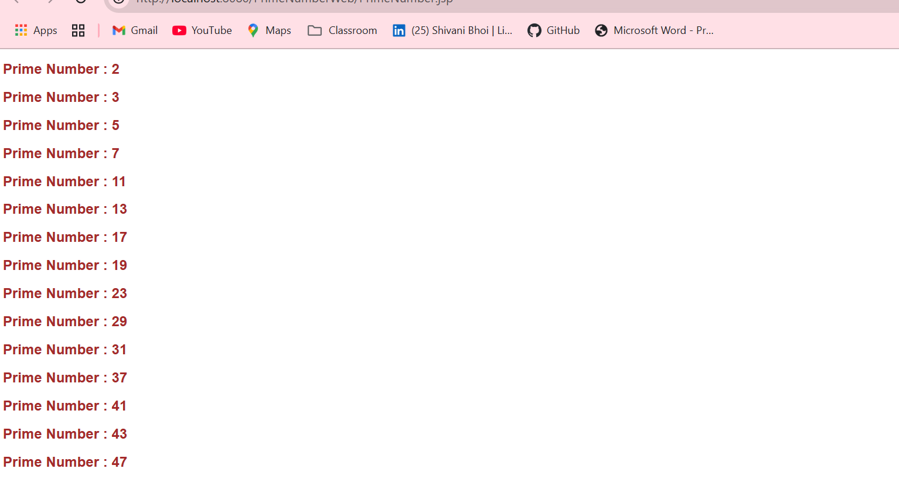

<ul>
<h1>Project:</h1>
<li><h2>Simple Website</h2></li>

Simple Website to implement register , login and profile functionality using servlet and jsp.

<h3>Active Functionality</h3>
<ol>
  <h3> <li>Home</li></h3>
  
  <h3>  <li>Register</li></h3>
  
   <h3>  <li>Login</li></h3>
  
  <h3>  <li>Profile</li></h3>
  
   <h3> <li>Table</li></h3>
  
</ol>

<li><h2>Prime Number Check</h2></li>

Check the prime number between 1 to 50 in jsp by using java code in jsp file.

<b><h3>Output</h3><b>

<li><h2>Pojo Class / Entity Object</h2></li>

This is the example of an entity object class. There are six packages , each page have an one Java file ,1.Employee.java 2. DistrictDetails.java 3.Student.java 4.PatientDetails.java 5.ProductDetails.java and 6.Main.java java file for handling /creating tables in database.This all is done by using hibernet.

<b><h3>Output</h3><b>

 

</ul>
